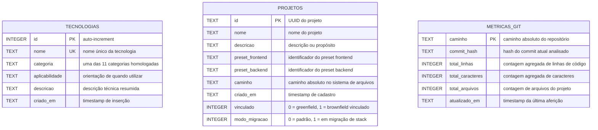

# Modelo de Dados & Entidades — rr-controle-de-agentes-1.1

**Projeto:** rr-controle-de-agentes-1.1  
**Marca:** RR Tech Studio | Autor: Rodrigo Rafael  
**Última Reconciliação:** 2026-10-06  

> **Diretriz Mandatória para Agentes:** Antes de criar ou alterar models, queries,
> endpoints ou manipulação de banco, consulte este documento para respeitar
> com exatidão a nomenclatura de tabelas, campos, chaves primárias e tipos.
> **Nunca presuma ou invente nomes de colunas.**

---

## 1. Diagrama Entidade-Relacionamento (ERD)

---

## 2. Catálogo Detalhado de Tabelas (SQLite)

### Tabela: `tecnologias`
Armazena o catálogo homologado de tecnologias, ferramentas e bibliotecas aprovadas para os projetos governados.

| Coluna | Tipo SQLite | Nulo | Chave | Default | Descrição / Restrições |
|--------|:-----------:|:----:|:-----:|:-------:|------------------------|
| `id` | `INTEGER` | Não | PK | Auto | Identificador numérico sequencial da tecnologia |
| `nome` | `TEXT` | Não | UK | - | Nome oficial e único da tecnologia |
| `categoria` | `TEXT` | Não | - | - | Uma das 11 categorias oficiais do catálogo |
| `aplicabilidade`| `TEXT` | Não | - | - | Cenários e casos de uso recomendados |
| `descricao` | `TEXT` | Não | - | - | Resumo do propósito e responsabilidade |
| `criado_em` | `TEXT` | Sim | - | `CURRENT_TIMESTAMP` | Data e hora de inclusão no banco |

---

### Tabela: `projetos`
Gerencia todos os projetos registrados sob o controle de governança.

| Coluna | Tipo SQLite | Nulo | Chave | Default | Descrição / Restrições |
|--------|:-----------:|:----:|:-----:|:-------:|------------------------|
| `id` | `TEXT` | Não | PK | - | Identificador único do projeto (UUID v4) |
| `nome` | `TEXT` | Não | - | - | Nome descritivo do projeto |
| `descricao` | `TEXT` | Sim | - | - | Descrição sucinta ou notas |
| `preset_frontend` | `TEXT` | Não | - | - | ID do preset de interface atribuído |
| `preset_backend` | `TEXT` | Não | - | - | ID do preset de backend atribuído |
| `caminho` | `TEXT` | Não | - | - | Caminho absoluto do diretório físico |
| `criado_em` | `TEXT` | Não | - | - | Data e hora da criação/vinculação |
| `vinculado` | `INTEGER` | Sim | - | `0` | Flag: 0 = criado do zero, 1 = vinculado |
| `modo_migracao` | `INTEGER` | Sim | - | `0` | Flag: 1 = projeto em processo de migração |

---

### Tabela: `metricas_git`
Cache persistente de volumetria de código e arquivos para acompanhamento da evolução dos projetos.

| Coluna | Tipo SQLite | Nulo | Chave | Default | Descrição / Restrições |
|--------|:-----------:|:----:|:-----:|:-------:|------------------------|
| `caminho` | `TEXT` | Não | PK | - | Caminho absoluto do projeto analisado |
| `commit_hash` | `TEXT` | Não | - | - | Hash SHA do commit Git aferido |
| `total_linhas` | `INTEGER` | Não | - | - | Quantidade total de linhas de código |
| `total_caracteres` | `INTEGER` | Não | - | - | Quantidade total de caracteres |
| `total_arquivos` | `INTEGER` | Não | - | - | Quantidade total de arquivos |
| `atualizado_em` | `TEXT` | Sim | - | `CURRENT_TIMESTAMP` | Data e hora da última aferição |

---

## 3. Localização Física e Acesso

- **Arquivo Físico:** `dados/rr.db`
- **Engine / Driver:** Módulo nativo `node:sqlite` (`DatabaseSync` no Node.js 22)
- **Modo de Concorrência:** Write-Ahead Logging (`PRAGMA journal_mode = WAL;`)
- **Módulo Responsável:** `src/servidor/db.ts`
- **Extração & Verificação:** Execute a skill [sincronizar-documentacao.md](../skills/sincronizar-documentacao.md) ou a skill [criar-extrair-modelo.md](../skills/criar-extrair-modelo.md) para reconciliar esquemas futuros.

---

*Documento mantido e reconciliado conforme os padrões da RR Tech Studio.*
