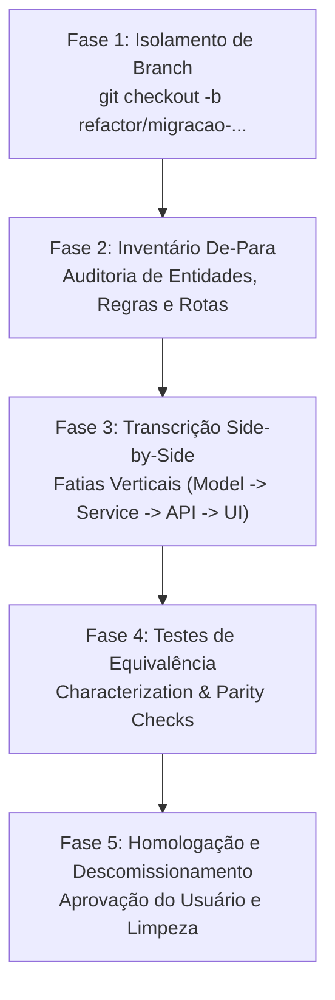

# Skill: Migrar Stack Legada (Replatforming Side-by-Side)

> **Objetivo:** Orientar o agente na modernização integral de uma aplicação existente para a nova stack contratada na governança ([02-stack.md](../livro-arquitetura/02-stack.md)), garantindo **zero perda de regras de negócio**, isolamento seguro em branch de refatoração, e migração estruturada passo a passo lado a lado.

---

## Princípio Fundamental: Paridade Absoluta sem Destruição Prematura

> [!CAUTION]
> **O código legado é a especificação viva mais precisa do sistema.**
> Documentações podem estar desatualizadas e requisitos verbais omitem regras sutis. O código existente contém todas as regras reais de validação, tratamento de erros de borda, integrações e transformações de dados.
> **NUNCA delete ou modifique o código legado antes de validar a equivalência na nova stack.**

---

## Quando Usar

- O projeto foi vinculado à governança no **Modo de Migração de Stack (Replatforming)**.
- Deseja-se migrar de uma stack antiga (ex: PHP/Laravel, Node legado, Python puro, Express sem tipagem, jQuery, ASP.NET legado) para a stack moderna dos presets RR Tech Studio (ex: Next.js App Router, Vite/React, FastAPI, Go Hono, etc.).

- A refatoração precisa preservar o comportamento do sistema para os usuários finais, evoluindo apenas a arquitetura, manutenibilidade, tipagem, segurança e performance.

---

## As 5 Fases da Migração



---

### Fase 1: Isolamento de Branch e Estrutura do Projeto

1. **Crie a branch de trabalho dedicada imediatamente:**
   ```bash
   git checkout -b {{branchSugerida}}
   ```
   *Se {{branchSugerida}} não estiver definida, use o padrão `refactor/migracao-para-<stack>`.*

2. **Organize o código legado para coexistência side-by-side:**
   Para permitir que o agente leia o código antigo enquanto constrói o novo sem conflito de dependências ou imports:
   - Se o projeto for mover o código fonte para `src/`, isole o código antigo temporariamente em um diretório como `src-legado/` ou `legado/`.
   - Mantenha os arquivos de infraestrutura legados intactos como referência (`package.json.old`, schemas SQL originais, etc.).
   - Certifique-se de que os arquivos do legado continuem rastreados no Git nesta branch.

---

### Fase 2: Inventário e Mapeamento De-Para (Auditoria Profunda)

Antes de escrever qualquer linha de código novo, o agente **DEVE** mapear todas as funcionalidades do sistema legado gerando o documento:
`governanca/relatorios/inventario-migracao.md`.

> [!TIP]
> **Engenharia Reversa Automática do Banco Legado:** Se o repositório legado utilizar banco relacional (PostgreSQL ou SQLite), execute a skill [criar-extrair-modelo.md](criar-extrair-modelo.md) antes de preencher a tabela de Entidades. O snapshot gerado em `modelo-de-dados/` mapeará automaticamente todas as tabelas, colunas, tipos reais, chaves estrangeiras e índices do legado.

O inventário deve conter 4 seções detalhadas:

#### 1. Entidades & Banco de Dados (De-Para)
| Tabela / Entidade Legada | Campos Críticos & Tipos | Modelo / Schema Novo | Migrações / Adaptações | Status |
|---|---|---|---|:--:|
| Ex: `usuarios` | id, email, senha_hash, role, dt_cadastro | `User` (Prisma / Drizzle) | Adicionar UUID, timestamps UTC | ⏳ Pendente |

#### 2. Regras de Negócio & Casos de Uso (De-Para)
| Regra / Caso de Uso | Onde residia no legado | Implementação Nova (Service/Handler) | Validações & Edge Cases | Status |
|---|---|---|---|:--:|
| Ex: Cálculo de comissão | `app/Services/Calc.php:45` | `src/servicos/calcular-comissao.ts` | Desconto se inadimplente (>30 dias) | ⏳ Pendente |

#### 3. Endpoints de API & Contratos de Integração (De-Para)
| Método & Rota Legada | Payload & Query Params | Rota Nova | Response & Status Code | Status |
|---|---|---|---|:--:|
| `POST /api/v1/pedidos` | `{ cliente_id, itens[] }` | `POST /api/pedidos` | Validação Zod estrita + 201 Created | ⏳ Pendente |

#### 4. Interfaces de Usuário & Componentes (De-Para)
| Tela / Fluxo Legado | Componentes Novos Equivalentes | Design System / Tailwind | Status |
|---|---|---|---|:--:|
| Tela de Checkout | `CheckoutForm`, `ResumoPedido` | Tailwind 4 + shadcn/ui + Lucide | ⏳ Pendente |

---

### Fase 3: Transcrição em Fatias Verticais (Vertical Slices)

> [!IMPORTANT]
> **Regra de Ouro:** Não faça migrações horizontais (ex: migrar todos os models de uma vez, depois todas as rotas).
> **Migre fatia por fatia vertical funcional.**
> Exemplo: Entidade "Produtos" completa (Schema → Migração de Banco → Repositório/Service → Rota de API → Componente UI) antes de passar para "Pedidos".

Para cada fatia vertical:
1. **Inspeção Linha a Linha:** Abra o arquivo legado correspondente e verifique cada condição `if`, cada validação e cada exceção lançada.
2. **Implementação com Tecnologias Oficiais:** Use estritamente as bibliotecas contratadas no [02-stack.md](../livro-arquitetura/02-stack.md) (ex: validação com Zod, tipagem TypeScript estrita, ORM contratado).
3. **Tratamento de Exceções e Erros:** Garanta que mensagens de erro ou formatos de resposta consumidos por integrações existentes continuem compatíveis ou explicitamente adaptados.
4. **Atualização do Inventário:** Marque o item como `✅ Migrado` no `governanca/relatorios/inventario-migracao.md`.

---

### Fase 4: Testes de Caracterização e Equivalência

1. **Testes Unitários e de Integração:**
   - Crie testes automatizados para a nova implementação cobrindo os mesmos cenários de entrada e saída do legado.
   - Teste valores limites, campos opcionais, valores nulos e casos de falha mapeados na Fase 2.
2. **Execução de Testes:**
   - Execute o comando de teste configurado no projeto (ex: `npm test` ou `pytest`).
   - Garanta 100% de aprovação dos testes antes de considerar a fatia concluída.

---

### Fase 5: Homologação e Descomissionamento do Legado

Quando todas as fatias verticais do inventário estiverem com status `✅ Migrado`:

1. **Apresente o Relatório Final ao Usuário:**
   - Mostre o `governanca/relatorios/inventario-migracao.md` 100% concluído.
   - Destaque melhorias implementadas (ex: ganho de tipagem, segurança, simplificação arquitetural).
   - Peça autorização explícita: *"Todas as regras de negócio foram transcritas e validadas com testes. Posso proceder com o descomissionamento da pasta legada e dependências antigas?"*

2. **Descomissionamento Seguro (Após Aprovação):**
   - Remova o diretório de código legado (`src-legado/` ou `legado/`).
   - Remova arquivos de configuração obsoletos da stack antiga.
   - Atualize [01-visao-geral.md](../livro-arquitetura/01-visao-geral.md) e [02-stack.md](../livro-arquitetura/02-stack.md) refletindo a nova realidade consolidada.
   - Crie o commit de consolidação da migração:
     ```bash
     git add .
     git commit -m "feat(migracao): conclui modernizacao da stack preservando regras de negocio"
     ```

3. **Instrua o Merge:**
   - Oriente o usuário a revisar a branch `{{branchSugerida}}` ou abrir um Pull Request para a branch principal.

---

## Anti-Padrões a Evitar Absolutamente

- ❌ **"Big Bang Rewrite":** Reescrever tudo de uma vez sem testar entidades e regras intermediárias.
- ❌ **Ignorar Edge Cases:** Ver um código confuso no legado e simplificar presumindo que "aquilo não serve para nada" sem investigar a regra de negócio subjacente.
- ❌ **Migrar na Branch Principal:** Fazer alterações diretas na `main`/`master` antes da nova stack estar operacional e testada.
- ❌ **Misturar Dependências Antigas e Novas no Destino Final:** Deixar pacotes da stack legada esquecidos no `package.json` após a conclusão.
